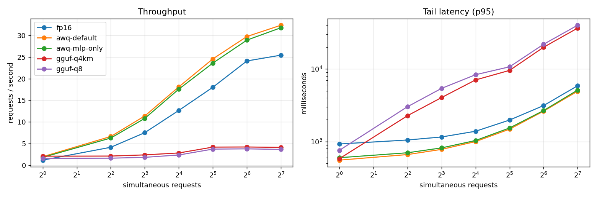
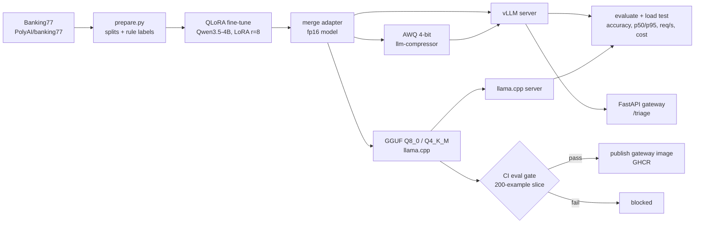

# Self-Hosted Banking Triage LLM

Fine-tune a small open model (**Qwen3.5-4B**) on [Banking77](https://huggingface.co/datasets/PolyAI/banking77) to read a customer message and return strict JSON,
compress it two ways (**AWQ 4-bit** and **GGUF**), serve it with **vLLM** and **llama.cpp**, and measure what each version costs to run.
A CI gate blocks a broken model from being published.

```json
{"intent": "card_arrival", "urgency": "low", "needs_human": false}
```

> `intent` is the Banking77 ground-truth label (77 classes). `urgency` and `needs_human` are **rule-derived from the intent** (`src/schema.py`),
> not human annotations, so their accuracy mostly reflects intent accuracy.

## Results

All five variants scored on the same 3,080 held-out test examples, **through the running server**, then load-tested on one **NVIDIA L4 (24 GB)**.
Requests are short (about 80 prompt tokens, 23 generated).

| Variant | Server | File size (GB) | Intent acc. | Macro-F1 | p50 latency, 1 request | p95 latency, 32 at once | Peak req/s | $ per 1M requests* |
|---|---|---|---|---|---|---|---|---|
| fp16 (merged) | vLLM | 9.10 | **0.9373** | 0.9375 | 856 ms | 1.98 s | 25.4 | 1.70 |
| AWQ 4-bit, default | vLLM | 5.37 | 0.9315 | 0.9317 | 513 ms | 1.48 s | **32.4** | **1.34** |
| AWQ 4-bit, MLP only | vLLM | 5.80 | 0.9331 | 0.9333 | 554 ms | 1.54 s | 31.8 | 1.36 |
| GGUF Q4_K_M | llama.cpp | **2.71** | 0.9357 | 0.9362 | **468 ms** | 9.55 s | 4.2 | 10.29 |
| GGUF Q8_0 | llama.cpp | 4.48 | 0.9370 | 0.9372 | 622 ms | 10.70 s | 3.8 | 11.46 |

\* GPU time only, at **$0.156 per GPU-hour** (Colab L4: 1.56 compute units/hour at $9.99 per 100 units), with the GPU 100% busy at its best load level.
At another price, scale linearly (a $1.00/h GPU is 6.4x these numbers); see `results/phase4/cost_table.md`. No hosted-API comparison is included.
The fp16 file includes an unused vision tower (0.67 GB); the GGUF files are text-only. All variants returned 100% valid JSON and had 0 errors under load.



### What the numbers say

1. **Fine-tuning is the big win.** Zero-shot, the base model gets about 63% intent accuracy on this task; after QLoRA on 9,003 examples it gets **93.9%** (full fine-tune run), with 100% valid JSON.
2. **Compression costs little quality.** Q8_0 and Q4_K_M are statistically indistinguishable from fp16 (paired McNemar p = 0.25 and 0.44). AWQ loses 0.4 to 0.6 points, which is measurable (p = 0.04 and p < 0.01) but small.
   In the error analysis, most remaining mistakes were between Banking77 intents that overlap in meaning, not malformed or nonsense output.
3. **AWQ is the cheapest to serve; GGUF is the smallest.** On vLLM, AWQ gives about 27% more throughput and 21% lower cost per request than fp16. Q4_K_M is 3.4x smaller than fp16, but its file is not the cheapest *service*.
4. **For many users, use vLLM. For one user or a laptop, use llama.cpp.** llama.cpp has the best latency for a single request and loads in 12 s (vLLM: 4 to 6 minutes), but it handles 6 to 8x fewer requests per second under load.
5. **llama.cpp's weak scaling is specific to this model, and settings do not fix it.** We tested slot counts (64, 16, 8, 1), flash attention, and batch size: every setting stayed at about 2x scaling from 1 to 32 requests.
   A plain-attention control model (Qwen3-4B) scaled 5 to 6x under identical settings. This is consistent with Qwen3.5's hybrid Gated-DeltaNet layers being handled less efficiently by llama.cpp; we did not profile the layers directly. See `results/phase4/tuning_summary.csv`.
6. **AWQ files are bigger than you might expect** (5.4 GB vs 2.7 GB for Q4_K_M) because the new `linear_attn` layers, embeddings and vision tower stay in 16-bit.

More detail, caveats and the model-selection story are in [`docs/FINDINGS.md`](docs/FINDINGS.md).

## Pipeline



| Phase | What | Where it ran | Notebook |
|---|---|---|---|
| 1 | Pilot: Qwen3.5-4B vs Gemma-4-E4B on 2,000 examples | Kaggle 2x T4 | `phase1_pilot_kaggle.ipynb` |
| 2 | Full fine-tune of the winner (9,003 examples) | Kaggle 2x T4 | `phase2_full_finetune_kaggle.ipynb` |
| 3 | Merge, GGUF, AWQ + quality table | Kaggle | `phase3a_merge_gguf_kaggle.ipynb`, `phase3b_awq_kaggle.ipynb` |
| 4 | Serving benchmarks (+ llama.cpp tuning) | Colab L4 | `phase4_serving_colab.ipynb`, `phase4b_llama_tuning_colab.ipynb` |
| 5 | CI eval gate | GitHub Actions (CPU) | `.github/workflows/eval-gate.yml` |

## Repository layout

```
src/schema.py          output schema, system prompt, rule-derived labels
src/formatting.py      renders prompts ONCE (thinking off) for train, eval and serving
src/train/qlora.py     QLoRA trainer (DDP-aware), MLflow tracking
src/quantize/          merge adapter; AWQ via llm-compressor
src/eval/              metrics, local + HTTP evaluators, paired stats, quant table, CI gate
src/serve/app.py       FastAPI gateway (validates input, returns schema-checked JSON)
loadtest/bench_raw.py  concurrency sweep (p50/p95/p99, req/s, tokens/s)
configs/               per-phase YAML; configs/gate.yaml = CI thresholds
results/               tables and CSVs behind every number above
tests/                 gate logic + gateway prompt tests
```

## Run it

The model weights are in a private Hugging Face repo (`Abhishek-255/banking-triage-qwen3_5_4b-quantized`) and are not in this repository.
Each phase is a notebook; the code zip is built from `src/`, `configs/`, `loadtest/`.

```bash
pip install -r requirements-ci.txt && python -m pytest -q tests      # gate + gateway tests, no GPU
python -m src.data.prepare                                           # data/ (needs internet)
python scripts/cost.py --hourly 0.156 --hourly 1.00                  # cost table from results/phase4/sweep.csv
```

Serve locally with a GPU: download a model folder from the repo into `./models`, then `MODEL_DIR=awq-default docker compose up`
and call `POST http://localhost:8080/triage` with `{"message": "My card has not arrived"}`. This path is **untested end to end** (see limitations).

## CI gate

`.github/workflows/eval-gate.yml` runs on every push and pull request: unit tests, then the Q4_K_M GGUF is served on a CPU runner and scored on a fixed,
class-balanced 200-example slice (`data/gate_slice.jsonl`) against `configs/gate.yaml`. The GHCR publish job `needs` the gate.
Floors sit about four standard errors below the measured score (intent accuracy 0.96 measured, floor 0.90).

**Proven in GitHub Actions** (same 200-example slice, same CPU runner):

| Candidate model | Intent acc. | Macro-F1 | Valid JSON | Invented labels | Gate |
|---|---|---|---|---|---|
| Fine-tuned Q4_K_M (this project) | 0.9600 | 0.9553 | 100% | 0.5% | **PASS** |
| Un-tuned Qwen3.5-4B Q4_K_M (`unsloth/Qwen3.5-4B-GGUF`) | 0.0250 | 0.0325 | 100% | 97.5% | **FAIL** (5 of 6 checks) |

The CPU-runner scores for the good model equal the GPU scores on this slice, so the gate measures the model, not the hardware. The evaluation step takes about 22.5 minutes on a free GitHub runner (200 examples, about 6.8 s each at 4 in parallel).
The un-tuned model writes valid JSON but invents intent names, which is why the invented-label ceiling is part of the gate.

**What the gate can and cannot catch:** it catches a *broken* model (bad quantization, wrong or corrupt file, template mismatch, un-tuned base model).
It cannot see a 0.5-point drift; that is far below the noise of 200 examples (about 1.4 points). Fine differences are measured on the full test set.

## Limitations (read before trusting the numbers)

- **One model, one dataset, one seed.** The pilot comparison of Qwen3.5-4B and Gemma-4-E4B was a statistical tie on quality (difference +0.25 points, 95% CI -0.55 to +1.15); Qwen was chosen on speed and memory. The planned second-seed rerun was not done.
- **Banking77 is clean and small-domain.** Real support traffic is messier; several intent labels overlap in meaning, which caps attainable accuracy. `urgency` and `needs_human` are rule-derived, not learned judgments.
- **One GPU, short requests.** Throughput and cost are for an L4 with about 80-token prompts and 23-token answers. Longer prompts change the picture. Costs assume 100% utilization at the best load level and a Colab-based price, not a cloud quote.
- **llama.cpp results are for llama.cpp as it handles Qwen3.5 today** (untuned beyond the tests above); newer builds may behave differently.
- **AWQ file sizes are approximate** (read from `du`, +-0.05 GB). vLLM's reported 14.5 GB GPU use is the memory share we allowed it, not what the model needs.
- **The gateway and docker-compose have not been run end to end** with the current model layout. The gateway's prompt is checked against the real tokenizer by a test, but the HTTP path itself is unverified.
- **No hosted-API baseline.** Add one by running `scripts/cost.py` with your API's prices.
